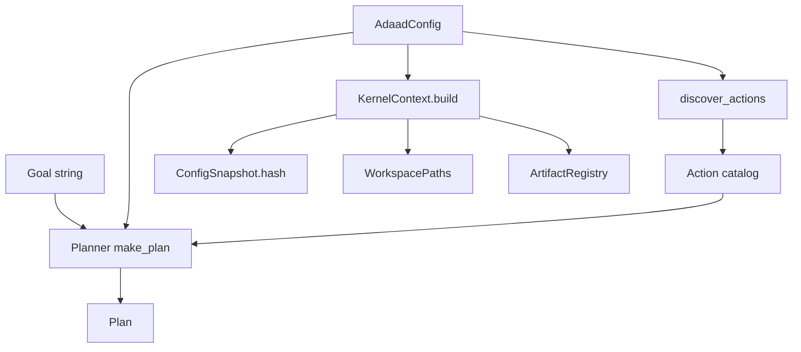
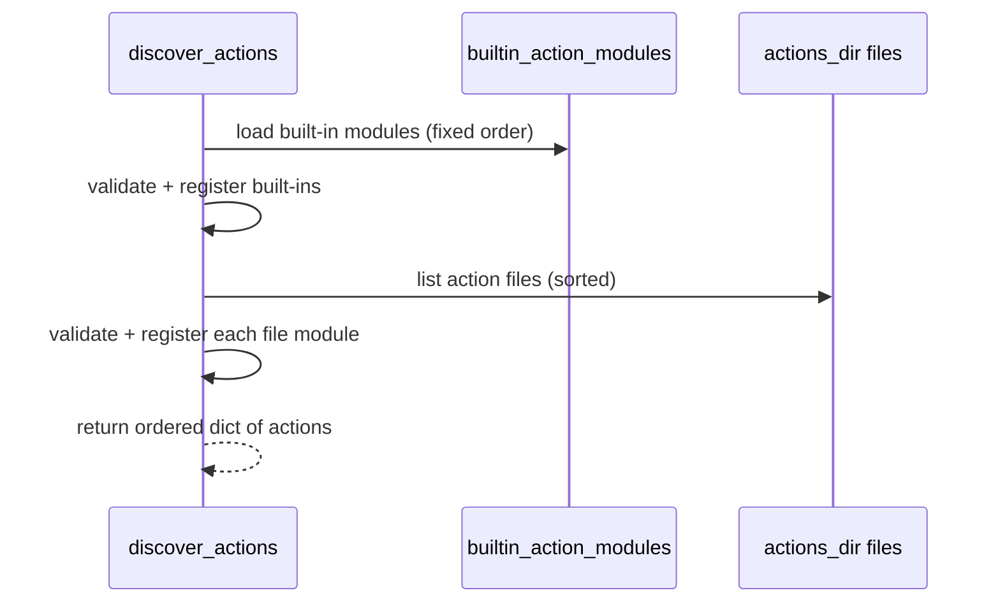

# ADAAD-6 Architecture

ADAAD-6 is a deterministic planning core designed for auditable, resource-bound systems.
This document defines the system boundaries, invariants, and verification hooks.

---

## Top-level overview

ADAAD-6 consists of:

- A deterministic planner that transforms a goal into a plan.
- An action registry that builds a catalog of validated action modules.
- A kernel layer for admissibility, evidence, hashing, and (optionally) ledger logging.

Execution is out of scope. If a runtime executes actions, it must do so outside this repo’s planning determinism claims.

---

## Component map

### Planning layer

- `adaad6.planning.planner.make_plan(...)`
  - Inputs: goal string, `AdaadConfig`
  - Output: plan object (serializable, golden-testable)
  - Constraints: step limit and time limit from config

- `adaad6.planning.registry.discover_actions(...)`
  - Builds the action catalog from:
    - built-ins (`adaad6.planning.actions.builtin_action_modules()`)
    - user actions (sandboxed actions_dir under cfg.home)

- Action spec (planner-internal structure)
  - Atomic planning unit
  - Preconditions, effects, params, and cost tiering

### Kernel layer

- `adaad6.kernel.admissibility`
  - Admissibility checks
  - Refusal mode policy

- `adaad6.kernel.hashing`
  - Canonical JSON
  - Object hashing
  - Hash attachment utilities

- `adaad6.kernel.context`
  - `WorkspacePaths`: resolves important paths under cfg.home
  - `ConfigSnapshot`: frozen config values + hash
  - `ArtifactRegistry`: immutable artifact map
  - `KernelContext`: run_id + workspace + config + artifacts

- `adaad6.kernel.failures`
  - Named failure modes for audit and test assertions

---

## Data flow diagram



Notes:
- Planner determinism claims apply to `make_plan(...)` given the same goal and the same config snapshot.
- Action execution is outside the determinism boundary. Planning may select actions; execution may vary by runtime.

---

## Trust boundaries

### Boundary 1: Planner core

The planner must be:
- deterministic
- bounded by config limits
- free of side effects

### Boundary 2: Registry and dynamic loading

User action modules are untrusted input.
The registry enforces:
- sandbox path resolution under cfg.home
- no symlink traversal
- deterministic load order
- required callable functions and valid signatures

### Boundary 3: Execution runtime (out of scope)

Action modules may contain side effects when executed by an external runtime.
Those effects must be audited separately.
ADAAD-6 only claims:
- deterministic planning
- deterministic catalog building (given identical filesystem state and built-ins)

---

## Determinism model

Determinism is defined as:

Given:
- identical goal string
- identical `AdaadConfig` values
- identical built-in action list
- identical user action directory contents (same files, same bytes, same paths)

Then:
- `discover_actions(...)` yields the same action set and ordering
- `make_plan(...)` yields the same plan content and ordering

Non-determinism sources that must be excluded from planning:
- randomness
- wall-clock without mocking
- environment-dependent ordering (unsorted iteration)
- hidden global state or caches
- external I/O during planning

---

## Invariants

These are contract-level guarantees. Tests should fail if any invariant breaks.

### I1. Planner determinism

Claim:
- Same goal + same config => same plan

Verification hooks:
- Golden snapshot tests for plan outputs.
- Ensure stable ordering for action selection and spec normalization.

Suggested tests:
- `tests/test_planner_golden.py` (add if not present)
- Determinism test with multiple runs in the same process and fresh processes.

### I2. Bounded planning

Claim:
- Planning must not exceed `planner_max_steps` or `planner_max_seconds`.

Verification hooks:
- Unit tests forcing truncation by step cap.
- Unit tests forcing time cap using a mocked clock.
- Plan metadata includes: `truncated`, `time_capped`, `tier`.

Suggested tests:
- `tests/test_planner_limits.py` (add if not present)

### I3. No side effects during planning

Claim:
- Planner performs no external calls (filesystem writes, network, subprocess).

Verification hooks:
- Monkeypatch common side effect APIs in tests and assert not called.
- Static analysis lint (optional).

Suggested tests:
- `tests/test_planner_no_side_effects.py` (add if not present)

### I4. Registry sandbox enforcement

Claim:
- `actions_dir` must resolve under `cfg.home`.
- Directory traversal via symlink is rejected.
- Action files that are symlinks are rejected.

Verification hooks:
- Tests that create symlink chains and confirm rejection.
- Tests that set actions_dir outside home and confirm rejection.

Existing coverage:
- Registry already enforces `actions_dir must resolve under cfg.home`.

Suggested tests:
- `tests/test_planning_registry_symlinks.py` (add if not present)

### I5. Registry contract enforcement

Claim:
- Every action module must define:
  - `validate(params, cfg)`
  - `run(validated)`
  - `postcheck(result, cfg)`
- All three must be callable and have acceptable signatures.
- Variadic args are rejected.
- Duplicate action names are rejected.

Verification hooks:
- Registry unit tests.

Existing coverage:
- `tests/test_planning_registry.py`

### I6. Built-ins always available

Claim:
- Built-in action modules are registered even if `actions_dir` is missing.

Verification hooks:
- Registry test when directory does not exist.

Existing coverage:
- `tests/test_planning_registry.py` includes directory-missing test.

### I7. KernelContext immutability and audit shape

Claim:
- `ConfigSnapshot.values` is immutable.
- `ConfigSnapshot.hash` equals `hash_object(asdict(cfg))`.
- `ArtifactRegistry` is immutable and rejects duplicates.
- `KernelContext.to_dict()` is JSON-serializable.

Verification hooks:
- Unit tests under `tests/test_kernel_context.py`.

Existing coverage:
- `tests/test_kernel_context.py`

---

## Execution model (explicitly out of determinism scope)

ADAAD-6 ships an optional reference executor under `adaad6.runtime.executor`.
Determinism claims apply only to planning and registry. Execution determinism is not claimed and depends on runtime + environment.
If you build your own executor, define and test your invariants, including:
- idempotency or retry semantics per action
- subprocess and filesystem policies
- network policies
- audit logging and evidence retention

Recommended separation:
- Planner process produces plan JSON + config snapshot hash.
- Executor process consumes plan JSON and emits an execution ledger.

Failure taxonomy note:
- Planner determinism violations still raise `DETERMINISM_BREACH`.
- Runtime timeouts are also mapped to `DETERMINISM_BREACH` to keep a single audit code for unexpected nondeterminism or hung execution.

---

## Diagrams for reviewers

### Registry loading order



### KernelContext composition

```text
KernelContext
  run_id: str (uuid by default)
  workspace: WorkspacePaths
    home
    actions_dir
    log_path
    ledger_path? (if enabled)
  config: ConfigSnapshot
    values: MappingProxyType(asdict(cfg))
    hash: hash_object(asdict(cfg))
  artifacts: ArtifactRegistry
    tuple[(name, uri)] (immutable)
```

---

## Reviewer checklist

- Planner has no hidden state and no side effects.
- Registry enforces sandbox rules and deterministic ordering.
- Built-ins are deterministic and safe to load.
- Kernel context is immutable and serializes cleanly.
- Tests exist for determinism, limits, registry invariants, and kernel context invariants.
