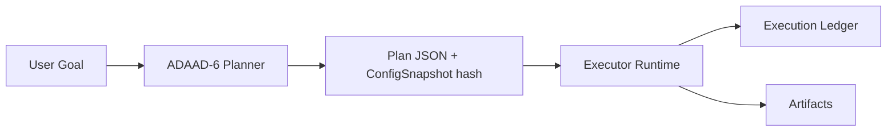

# Design Rationale

This document explains the core design decisions behind ADAAD-6, including why autonomy is explicitly excluded.

---

## Primary objective

ADAAD-6 exists to produce credible, replayable plans under hard constraints.
The product is a deterministic planning substrate that can be audited, tested, and embedded.

The core trade:
- maximize predictability, auditability, and boundedness
- minimize scope, side effects, and hidden coupling

---

## Why autonomy is excluded

Autonomy is excluded because it conflicts with the core guarantees ADAAD-6 is designed to make.

### 1) Determinism guarantees are hard to maintain under open-ended autonomy

Autonomous systems commonly require:
- dynamic exploration
- adaptive policy updates
- opportunistic tool use
- stochastic sampling

Even if some autonomous behaviors can be made reproducible, the operational envelope expands dramatically:
- more state
- more external dependencies
- more non-deterministic surfaces

ADAAD-6 chooses a smaller, provable surface area.

### 2) Auditability requires explicit boundaries

Auditors and reviewers need:
- a stable definition of what the system does
- clear separation of planning vs execution
- stable, testable interfaces

Autonomy blurs boundaries:
- the system decides what to do next
- the system decides which tools to invoke
- the system changes its own behavior over time

ADAAD-6 keeps decisions inspectable by ensuring the planner only produces plans.
Any executor must be explicit and separately audited.

### 3) Safety and policy enforcement belong at execution time

Most real-world risk is in side effects:
- filesystem modifications
- network calls
- subprocess execution
- credential usage

An autonomous runtime tends to mix:
- plan formation
- execution
- tool selection
- error recovery

That fusion makes it harder to prove:
- which policies were applied
- which invariants held at each stage

ADAAD-6 isolates planning as a side-effect-free operation.

### 4) Embedded and mobile constraints demand bounded behavior

Many target environments are constrained:
- mobile devices
- edge devices
- offline operation
- hard CPU and time caps

Autonomous loops are frequently:
- unbounded
- stateful
- sensitive to environmental noise

ADAAD-6 enforces explicit limits (`planner_max_steps`, `planner_max_seconds`) and records them in metadata.

### 5) “Autonomy” is a product-layer decision, not a core primitive

Autonomy can be built on top of ADAAD-6 by composing:
- a planner (this repo)
- an executor with policies, logging, and sandboxing
- a state/memory layer with provenance rules
- optional learning components

Keeping ADAAD-6 narrow prevents downstream systems from inheriting accidental complexity.

---

## What you get instead of autonomy

### Credibility surface

ADAAD-6 makes claims that are cheap to verify:
- deterministic outputs
- bounded planning
- registry sandbox constraints
- stable config snapshot hashing

### Composability

You can integrate ADAAD-6 into:
- CI pipelines
- compliance workflows
- embedded apps
- safety-critical orchestration systems

The planner becomes a predictable “compiler” from goals to action sequences.

---

## Threat model (planning core)

ADAAD-6 assumes:
- user actions are untrusted code
- filesystem paths can be adversarial
- imports can be abused for side effects

Mitigations:
- actions_dir must resolve under cfg.home
- no symlink traversal in directory resolution
- action files must not be symlinks
- required function existence + signature checks
- deterministic load order
- duplicate name rejection

Non-goals:
- preventing malicious behavior inside an action’s `run` function
  - execution is outside the scope and must be sandboxed by the runtime

---

## Design choices that reinforce non-autonomy

### No executor in the planning core

If the planning core executed actions, it would:
- require IO and process policies
- require runtime capability controls
- create non-deterministic failure modes

An optional reference executor (`adaad6.runtime.executor`) exists for governed environments, but it is outside determinism guarantees and must be audited in its runtime context.

### ConfigSnapshot hashing

`ConfigSnapshot` binds runs to an auditable configuration state:
- `values` is immutable
- `hash` is deterministic over `asdict(cfg)`

This helps downstream systems:
- record exactly what was used
- detect drift
- enforce reproducibility

### Immutable ArtifactRegistry

`ArtifactRegistry` is immutable and duplicate-resistant:
- prevents silent overwrites
- supports ledger-style append-only semantics in your runtime

---

## If you want autonomy anyway

Build a separate layer with explicit contracts.
Recommended minimal architecture:

Executor responsibilities (not ADAAD-6):
- policy enforcement
- capability gating
- sandboxing
- audit logging
- idempotency and retries
- secrets management
- network and filesystem allowlists

If you ship “autonomy,” define it as:
- a controlled loop with explicit stop conditions
- bounded steps and time
- a ledger entry per side effect
- a stable replay model

---

## Decision summary

ADAAD-6 excludes autonomy to protect:
- determinism
- auditability
- boundedness
- composability
- embedded feasibility

Autonomy is a higher-level product concern that should be implemented as a separate, explicitly-audited layer.
